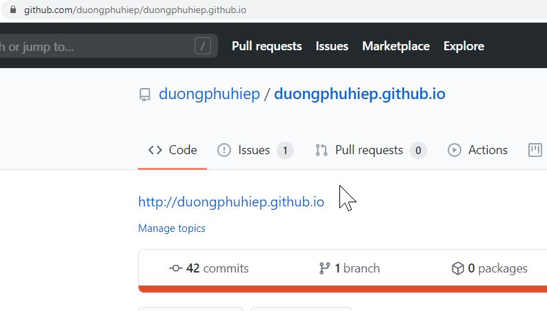
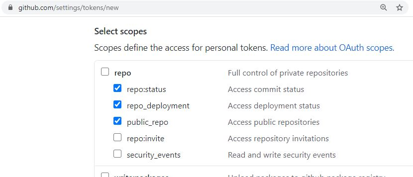

None of the FREE blogging platforms fit my taste! As a fullstack developer it was a shame if I can't built my own website..

## Requirements for my Blog

* No-cost (otherwise it is a shame for me!)
* Easy-to-read interface.
  * peoples with slight vision imperfections (eg. Color Vision Deficiency) should be able to read my blog without much effort.
* Manage content (CRUD) should not complicate.
* I usually write text and codes snippets so Markdown format is a no-brainer.
  * Super complex and Rich contents usually go to my **Google Slides** => Ease to embedded the **Google Slides** in markdown contents is a requirement.
* Comments capability: Reader would be able to comment to my blog posts

### Other nice-to-have functionalities

* Search
* "like" button (or "clap" button)
* a beautiful interface without the sacrifice of the "Easy-to-read interface" requirement
  * "No" for weak-contrast themes (for eg. "gray text" on a "light gray background")
  * "No" for text blend on a image background
  * "No" for uses of multi-layer with transparent color
* All the content should have backup (or revision history)

## codepen.io - An effortless solution

[codepen.io](https://codepen.io/dashboard) offers a free blog solution satisfying most of my requirements. Although, there are some limitations:

* If you want to embed image in your post you must to upload it somewhere else.
  * Tips: I usually Copy/Paste my images to a github issues editor => github will then generate an URL to the images, then I can use the URL anywhere.
* You cannot embed **Youtube** or **Google Slides**
* You cannot get rid of the codepen menu and the small sponsor logo.. (though it is not really relevant or hinder the reader in anyway).

Despite these minor limitations, I recommend **codepen.io** to all developers with similar requirements (If you don't want to get your hand dirty)

## Build my own blog

The best suitable tools for A markdown-centric CMS is a [Static Sites Generator (SSG)](https://www.staticgen.com/) on a [Jamstack](https://jamstack.org/).

The idea is that.

* you design the look (the theme) of your website with a [HTML-template language](https://www.google.com/search?q=html+template+language) + CSS (or SCSS) + basic Javascript (jquery).
* you write contents (blog's posts) in markdown.
* then the SSG will combine these two to generate a static website (a bunch of static HTML/CSS/Javascript)
* then any jamstack web server can host this static website (no need PHP, no need nodejs, no need python.. on the hosting server)

In my case:

* My [blog codes sources](https://github.com/duongphuhiep/blog1) contains
  * The theme (or template)
  * The content in markdown format
* then [Hugo](https://gohugo.io/) generates the **Static website**.
* finally [travis](https://travis-ci.org/) deploy the **Static website** on [my github page](https://github.com/duongphuhiep/duongphuhiep.github.io).

There is so many [Static Sites Generator](https://www.staticgen.com/) today. I don't wanna get trouble for a small personal blog.. so I picked [Hugo](https://gohugo.io/) - the (likely) most mature and popular **Static Sites Generator** with a huge community backup...

If you are a Web (or full-stack) developer then the learning step shouldn't be too much of a problem.

* I recommend you to watch [this series](https://www.youtube.com/playlist?list=PLLAZ4kZ9dFpOnyRlyS-liKL5ReHDcj4G3) first



* Then try to look for a [nice theme](https://themes.gohugo.io/) as a base and tweak it to your taste.
* Dive in [the documentation](https://gohugo.io/documentation/) only to search for thing you need to know in detail.

## Deployment

Each time I push something to my [Blog codes sources](https://github.com/duongphuhiep/blog1) (eg. make changes in contents or theme), then it will be automatically re-built and re-deploy to [my github page](https://github.com/duongphuhiep/duongphuhiep.github.io)

Here how I used [travis](https://travis-ci.org/) to make this magic happened.

* Step 1: Create the repo on github the repo name must to be `YOUR_GITHUB_LOGIN.github.io`

* Step 2: [Create a **Access Token**](https://help.github.com/en/github/authenticating-to-github/creating-a-personal-access-token-for-the-command-line). Give the access token the permissions to Read / Write your public repositories.

* Step 3: Give the **Access Token** to **travis**

## Comment capability

Instead of paid solutions such as *muut*, *disqus*.., I used **utteranc.es**... You must to have a github account in order to comment on my blog. Most of my reader would be developers anyway. A developer without a github account shouldn't spam my blog so **utteranc.es** is the best fits in my case.

## Hidden screens

There is some hidden "screen" in my blog. They are called "taxonomies"

* [tags list](/tags)
* [categories list](/categories)

I didn't expose them because they are not really useful.

## This is just a start

This Blog current theme is not meet 100% my satisfaction, and there is some functionalities I wanted to have in this blog (with no-cost again), but I have not found a way yet.

You might notice the [codes sources of this blog](https://github.com/duongphuhiep/blog1) is "blog1", which means I might explorer other tooling / method to make "blog2", "blog3".. in the future, and just throw this "blog1" away. 

As a fan of [vuejs](https://vuejs.org/). I'm keeping an eye on the [vitepress project](https://github.com/vuejs/vitepress), I hope it will make it way to success and achieve maturity in a few years.

All that to say, this blog is just another toy for me to play with sometimes and I don't intent to write new contents in a regular basis.
